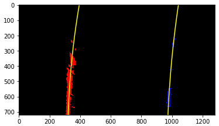
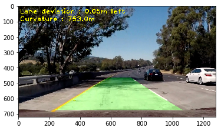

#Advanced Lane Finding Project

The goals / steps of this project are the following:

* Compute the camera calibration matrix and distortion coefficients given a set of chessboard images.
* Apply a distortion correction to raw images.
* Use color transforms, gradients, etc., to create a thresholded binary image.
* Apply a perspective transform to rectify binary image ("birds-eye view").
* Detect lane pixels and fit to find the lane boundary.
* Determine the curvature of the lane and vehicle position with respect to center.
* Warp the detected lane boundaries back onto the original image.
* Output visual display of the lane boundaries and numerical estimation of lane curvature and vehicle position.

**I will present all the goals/steps with more details in the rest of this document. **

##Camera Calibration


The calibration is done by the class Camera defined in the cell 2nd code cell and effective calibration in the 4th code cell of [the iPhython Notebook](./Advanced-Lane-Lines.ipynb) 

The Calibrate function use chessboard image and the number of corner on the chessboard. Based on the images and the help of `cv2.findChessboardCorners` to find the corners in the images. I am also preparing at the same time the 'object points', which are the corners coordinate in the world. I am assuming the chessboard is fixed on plane z=0.

With all those points i am using `cv2.calibrateCamera()` to compute the camera calibration and the distortion coefficients that can be used by `cv2.undistort()` to undistort an image. 

Example of the chessboard undistorted


##Pipeline (single image)

###Step 1. Undistort the image.
Here we use the undistort function from the Camera object that has been previously calibrated.
Here is an example.

###Step 2. Binary image using Gradient and Channel threshold

The function `binay_image_extraction` in 11th code cell of [the iPhython Notebook](./Advanced-Lane-Lines.ipynb) contains the steps to generate a binary image.
1. Convert the image to hls color space which represent better the color and ease the thresholding.
2. Keep the luminosity channel between 60 and 100, so the threshold on this channel will not be to much affected by the light and shadow.
3. Generate binary color threshold on each channels
4. Generate binary gradient threshold on luminosity channel
5. Combine them to generate a binary image
6. Use a median filter to remove artefact that looks like salt&pepper noise

All the thresholds have been selected manually by experimentation with different images.


###Step 3. Perspective transform

The perspective transform is done by a class Perspective in the 3rd code cell and the effective configuration in the 7th code cell of [the iPhython Notebook](./Advanced-Lane-Lines.ipynb)

The class need the source and destination point to compute the perspective selected. The it uses the function `cv2.getPerspectiveTransform` to compute the perspective matrix from source to destination and the opposite one. Then we can use the `transform` and `transform_inv`  to apply the perspective to an image.

I have hardcoded the source and destination points with the following values:

| Source        | Destination   | 
|:-------------:|:-------------:| 
| 280, 675      | 355, 719        | 
| 573, 465      | 355, 0      |
| 720, 465      | 955, 0      |
| 1042, 675     | 955, 719        |

I verified that the perspective effectively transform the trapezoid into parallel lines.


###Step 4. Polynomial line fit

In order to fit the lane lines with a 2nd order polynomial, two functions are used depending on if we have or not already a polynomial fit. Those functions are using a binary birdeyes view representation of the original image to work with.

- The blind search is done by `line_fit_blindsearch` defined in 14th code cell of [the iPhython Notebook](./Advanced-Lane-Lines.ipynb)
   1. Use an histogram representation of 3/4 the image height and `argmax` on both side of the center point of the image to identify potential horizontal position of the lines. If the distance between those points are two small or too big compared to a normal lane width (3.7 meter) we redo our search using the first peak over 20 votes. This is to reduce the noise effect.
   2. We are using a sliding window from the bottom of the image centered to the current research point, then we move up recentering the image on the mean of the current window. We select all non-zero pixels from those windows.
   3. Once we have all that points we are fitting them in a 2nd order polynomial using `numpy.polyfit`
   
- The targeted seach is done by `line_fit_targetedsearch` defined in 15th code cell of [the iPhython Notebook](./Advanced-Lane-Lines.ipynb). 
   1. Use the already known polynomial to target the reseach to this polynomial with a margin and select all non-zero pixels in this area.
   2. Use `numpy.polyfit` to fit a 2nd order polynomial

Here an example of the pixel selected to be part of the line as well as the fit computed



###Step 5. Compute the radius of curvature of the lane and the position of the vehicle with respect to center.

The curvature is computed by the function `get_lane_curvature` defined in 17th code cell of [the iPhython Notebook](./Advanced-Lane-Lines.ipynb). 
The curvature of the lane is the average of the curvature of each lines.

The curvature is computed using the formula below


Which translated to our 2nd order polynomial (`f(y) = Ay^2 + By +C`) give us


The vehicle deviation from center of the lane is computed by `get_lane_deviation` defined in 16th code cell of [the iPhython Notebook](./Advanced-Lane-Lines.ipynb). 
We just use the position of the lines (left/right) at the bottom and compute the deviation of the center of the lane with respect of the center of the image. To do so we assumed that the camera is centered in the vehicle.

Those equation give us the result in the pixel worlds, so we have to apply a transformation in meter. As the lane is 3.7m large in highways, and based on the strait lines image i defined the below conversion
```
XMETER_PER_PIXEL = 3.7/592 # meters per pixel in x dimension in birdeyes view
YMETER_PER_PIXEL = 20/720  # meters per pixel in Y dimension in birdeyes view ( assuming 20 meters based on lane length)
```

###Step 6. Draw the lane area identified in the original image.

The function `add_lane_detection_overlay` defined in 19th code cell of [the iPhython Notebook](./Advanced-Lane-Lines.ipynb) draws the area defined by the fitting lines in a birdeyes view image, then transform it back to the camera perspective and blend it with the original image.

We add as well in the pipeline the text regarding the curvature and deviation.

Here is an example of the final result



##Pipeline (video)

The pipeline used by the video is coded in the `process_image` function defined in 22nd code cell of [the iPhython Notebook](./Advanced-Lane-Lines.ipynb).  It is is just a sequence of the pipeline we just described in the previous section. Then the video is encoded using this pipeline.

Here's a [link to my video result]()


##Discussion

While the pipeline works well on the project video, it doesn't perform well on teh challenge videos and miserably on the hardest one. The main reason is that the current pipeline fails to enhance a extract the lines under poorly lighting condition (like in the hardes challenge) as well as when the lines are occluded by shadows/cracks... 
To improve the detection, we need to better clean the image like removing shadow, use tracking technics to keep focused on the lines once detected.

